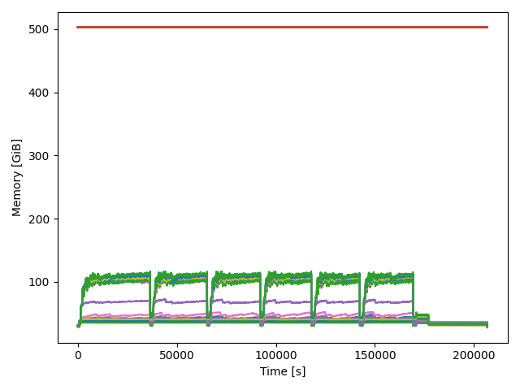

# OS performance for Linux

Repository to gather utilities for gather performance indicators from 
the OS statistics and generate plots offline for performance analysis.

- [OS performance for Linux](#os-performance-for-linux)
  - [Installation](#installation)
  - [Memory sampling](#memory-sampling)
    - [Usage](#usage)
  - [Performance metrics](#performance-metrics)
  - [I/O performance sampling](#io-performance-sampling)
  - [PIDSTAT](#pidstat)


## Installation

The repositori contains several bash wrappers to conduct the performance data
collection. For each case, find the required command in each subsection. 
Regarding the plotting , it requirres Python packages that are listed in 
the *requirements.txt* file, to install them use:

```bash
pip install -r requirements.txt
```

## Memory sampling
A simple environment to trace and plot memory usage on a linux server cluster. 
The python script parses the output of the `free` linux command.



### Usage

To collect the memory information, you need to execute the `free` command with 
a certain sampling period and save the output into a plain text file. After 
the execution, the plotting app can generate different plost with the memory 
usage at each sampling instant. The `mem-sampling-wrapper.sh` file could be used.

For clusters using SLURM scheduling system, you can use `slurm.sh <jobId>` 
for run the free command. If you don't have a parallel filesystem you need to
gather all the files

> It's important to don't use the human-redable option (`-h, --human`).

There are several arguments for the plotting app (save name, units, 
plot percentatge), but the file and the sample time are mandatory args.

```bash
  -h, --help            
  --files FILES [FILES ...]
                        Input files, can use wildcard like *
  --samp SAMP           Sampling time
  --save SAVE           Enable and define save file name
  --swap                Enable swap plotting
  --total               Enable total memory available?
  --percentage          Plot perc of usage
  --legend              Plot legend
  --output_units OUTPUT_UNITS
                        Set output units for the plots
  --output_scale OUTPUT_SCALE
                        Factor that will be divide the memory results
  --file_pattern FILE_PATTERN
                        Set the file pattern for the input files
```

Next code block shows you an example of the units managment. The input file
is in KiB (default of free), so we need to divide by 1024*1024=1048576 to get
GiB in the plot:

```bash
# Example :
./app/main.py --samp 2 --files test_inputs/alfa-mem.log --output_units GiB \
--output_scale 1048576
```

## Performance metrics
Use perf for gather performance metrics, from the OS. A bash wrapper is used 
for simplicity. After the execution the output file can be parsed with a Python
plotting app. The are several use cases for this:

1. Parse 1 performance file and 
2. Compare N performance files [WIP]
3. Plot N performance files results [WIP]
4. Check balance ofr N performance files of an multi-node execution (MPI) [WIP]

## I/O performance sampling

To sample the I/O performance of an application, use:

````bash
SAMP_INTERVAL=10

pidstat -d -h --dec=0 $SAMP_INTERVAL 
# Discard header:
pidstat -d -h --dec=0 $SAMP_INTERVAL   | grep -v '^# Time' &> io_sampling.log
````

## PIDSTAT

```bash
pidstat -u $SAMP_TIME $NUM_SAMPLES &> samp.log
```